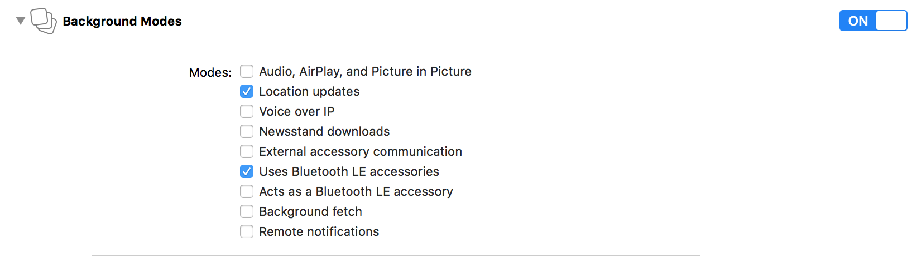

<html>
<body>

<h1 id="beacons-implementation-guide">Beacon's Implementation Guide</h1>

<strong>iOS</strong>

Last update : <em>31/03/2017</em> 
Release version : <em>4.1.0</em>

<ul>
<li><a href="#beacons-implementation-guide">Beacon's Implementation Guide</a></li>
<li><a href="#introduction">Introduction</a><ul>
<li><a href="#beacon-101">Beacon 101</a></li>
<li><a href="#types-of-beacons">Types of beacons</a></li>
<li><a href="#good-practice">Good practice</a></li>
<li><a href="#limitations">Limitations</a></li>
</ul>
</li>
<li><a href="#implementation">Implementation</a><ul>
<li><a href="#dependencies">Dependencies</a></li>
<li><a href="#compatibility">Compatibility</a></li>
</ul>
</li>
<li><a href="#scanning-for-beacons">Scanning for beacons</a><ul>
<li><a href="#background-scanning">Background scanning</a></li>
<li><a href="#tcdemo">TCDemo</a></li>
</ul>
</li>
<li><a href="#support-and-contacts">Support and contacts</a></li>
</ul>

<h1 id="introduction">Introduction</h1>

The Beacon module helps you scan your surrounding and parse the data from the beacons found.

<h2 id="beacon-101">Beacon 101</h2>

Beacons are devices that use the Bluetooth Low Energy (BLE) protocol to repeatedly send short transmissions. Those short transmissions depends on the type of Beacon, basic iBeacons and EddyStone UUID beacons only sends a simple UUID, while Eddystone's URL type sends a complete URL as it's name states.

It allows us to discover when a user is physically close to one of your beacon.

<h2 id="types-of-beacons">Types of beacons</h2>

Here is the list of the types of beacons currently supported by Commanders Act's module:

<ul>
<li>iBeacons : Which broadcast an UUID with a Major and a Minor.</li>
<li>Eddystone : Exist with 4 types of frames, UUID, URL, Telemetry and EID.</li>
</ul>

When you use a beacon, it is recommended that you only access information from your network of beacons. To do that the scan are filtered by an ID (beside with Eddystone's URL beacons), on iBeacon we use the full UUID of the beacon, on Eddystone we use the first part of it (called the namespace).

As an example for our demo application we filter on "397180b5-be24-4090-8af5-8237f4e17248" when we are dealing with our iBeacons and on "017180B5-BE24-4090-8AF5" for our Eddystone ones.

<a href="https://github.com/google/eddystone/blob/master/protocol-specification.md">If you want specific technical documentation on Eddystone's protocol, please check this link</a>

<h2 id="good-practice">Good practice</h2>

Scanning in itself doesn't use too much of your battery (but still use some of course). It is <em>recommended</em> that you ask the user to opt-in for beacon scanning and also explain how it will be beneficial for him. As bluetooth must be enabled, explaining everything to him will also push him to activate the bluetooth more often.

<h2 id="limitations">Limitations</h2>

Right now, we only allow to scan and filter on one UUID. It is the classic implementation to rely on one UUID and have major/minors depending on your shops and where your beacons are placed. (or one namespace and several instances).
If you need a specific implementation or information, please contact support.

<h1 id="implementation">Implementation</h1>

<a href="../README.md">Please check the Developers Implementation Guide to choose the best way to implement this module in your project.</a>

<h2 id="dependencies">Dependencies</h2>

Beacon requires the following frameworks:

<ul>
<li>CoreLocation.framework</li>
<li>CoreBluetooth.framework</li>
<li>TCCore.framework</li>
</ul>
<h2 id="compatibility">Compatibility</h2>
<ul>
<li>Architecture: armv7, arm64, i386 and x86_64, bitcode sections</li>
<li>deployement target: 8.0</li>
<li>Compiled with ARC enabled</li>
</ul>
<h1 id="scanning-for-beacons">Scanning for beacons</h1>

Scanning for beacon is pretty easy, tell us what we need to scan for, and we'll give you updates.

The first thing you want to do is to listen to the events we will send you when we found, update or lost a beacon.

You can use an helper class we created for notifications or do it all by yourself. The following lines show you how to do it and give you the names of the notifications.

<pre>self.listenerDelegate = [[TCEventListener alloc] init];
self.listenerDelegate.parent = self;
[self.listenerDelegate listen: kTCNotification_BeaconFound];
[self.listenerDelegate listen: kTCNotification_BeaconUpdate];
[self.listenerDelegate listen: kTCNotification_BeaconLost];
</pre>

When you have your user consent to scan for beacons, you can call the following code to scan for an Eddystone beacon:

<pre>[TCDebug setDebugLevel: TCLogLevel_Verbose];
[[TCBeacons sharedInstance] startWithBeaconType: kTCEddystoneServiceID andID: @&quot;017180B5-BE24-4090-8AF5&quot;];
</pre>

Or if you want to scann for an iBeacon:

<pre>[[TCBeacons sharedInstance] startWithBeaconType: kTCiBeaconServiceID andID: @&quot;397180b5-be24-4090-8af5-8237f4e17248&quot;];
</pre>

If you only want to scan URL type beacons, no need to pass the module any UUID at all.

And then create the delegate method for the notifications (here simply logging the result):

<pre>- (void) onNotificationReceived: (NSNotification *) incomingNotification
{
    NSString *notificationName = incomingNotification.name;

    if ([notificationName isEqualToString: kTCNotification_BeaconFound])
    {
        NSString *frameType = [incomingNotification.userInfo objectForKey: kTCUserInfo_FrameType];

        if ([frameType isEqualToString: kTCEddystoneFrameType_UUID])
        {
            TCEddyStoneID *beaconID = [incomingNotification.userInfo objectForKey: kTCUserInfo_BeaconObject];
            [[TCLogger sharedInstance] logMessage: [NSString stringWithFormat: @&quot;%@&quot;, beaconID] withLevel: TCLogLevel_Debug];
            // treat your beacon here.
        }
    }
}
</pre>

<h2 id="background-scanning">Background scanning</h2>

The important thing to do is enable it for your own project. to do that you need to go to your Target, click on the Capabilities button and under Background Modes check "Location updates" and "Uses Bluetooth LE accessories". This will automatically adds the required keys in your plist file.

/!\ Please take note that Apple is doing things it's way and background scanning won't be as fast and frequent as it is on foreground.

<h2 id="tcdemo">TCDemo</h2>

You can of course check our demo project for a simple implementation example.

<a href="https://github.com/TagCommander/Beacon-Demo/tree/master/iOS">Beacon Demo</a>

<h1 id="support-and-contacts">Support and contacts</h1>

<strong>Support</strong>
<em>support@commandersact.com</em>

http://www.commandersact.com

Commanders Act | 3/5 rue Saint Georges - 75009 PARIS - France

This documentation was generated on 31/03/2017 09:39:00

</body>
</html>