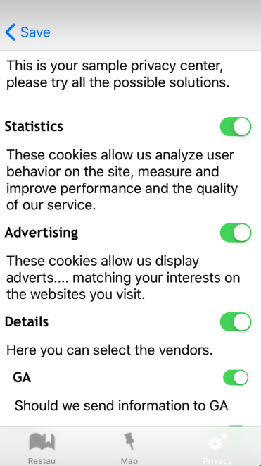

<html>
<body>

<h1 id="privacys-implementation-guide">Privacy's Implementation Guide</h1>

<strong>iOS</strong>

Last update : <em>13/03/2019</em> 
Release version : <em>4.3.1</em>

<ul>
<li><a href="#privacys-implementation-guide">Privacy's Implementation Guide</a></li>
<li><a href="#introduction">Introduction</a><ul>
<li><a href="#choose-your-privacy">Choose your privacy</a><ul>
<li><a href="#with-the-sdk">With the SDK</a></li>
<li><a href="#standalone">Standalone</a></li>
</ul>
</li>
<li><a href="#setup">Setup</a><ul>
<li><a href="#with-the-sdk_1">With the SDK</a></li>
<li><a href="#standalone_1">Standalone</a></li>
</ul>
</li>
<li><a href="#giving-consent">Giving consent</a><ul>
<li><a href="#with-the-privacy-center">With the Privacy Center</a></li>
<li><a href="#mannually-displayed-consent">Mannually displayed consent</a></li>
</ul>
</li>
<li><a href="#saving-consent">Saving consent</a></li>
<li><a href="#displaying-consent">Displaying consent</a><ul>
<li><a href="#global-consent">Global consent</a></li>
</ul>
</li>
<li><a href="#reacting-to-consent">Reacting to consent</a></li>
<li><a href="#tcdemo">TCDemo</a></li>
<li><a href="#privacy-center">Privacy Center</a></li>
</ul>
</li>
<li><a href="#support-and-contacts">Support and contacts</a></li>
</ul>

<h1 id="introduction">Introduction</h1>

Having the user consent is essential to send sensible information like the IDFA/AAID.
To prevent having to manually save the consent asked to the user and manually using it with our SDKs, we created a module helping you do it automatically.

This module will gather the consent and will:

<pre>- Save it and reload it every time the application is launched.
- Save and check the validity of the consent. The validity duration is set to 13 months.
- Send a hit to our servers to record the consent.
- Enable or disable the SDK. (if used alongside the SDK)
- Add the categories automatically to the hits the SDK sends. (if used alongside the SDK)
</pre>

<h2 id="choose-your-privacy">Choose your privacy</h2>

Privacy come with 2 major flavors:

<h3 id="with-the-sdk">With the SDK</h3>

With the SDK, you will need to have the SDK module in your app and will have to initialize the Privacy module with an instance of the TagCommander class.

<h3 id="standalone">Standalone</h3>

You won't need the SDK module, and will need to implement a callback to manage your solutions when consent is given or re-loaded.

And 2 ways to display it inside your app:

<pre>- Manually and send us the information
- Using our Privacy Center
</pre>

<h2 id="setup">Setup</h2>

After initialisation the Privacy module will check the consent validity. If the consent is too old a callback will be called. Please check the Callback part.

<h3 id="with-the-sdk_1">With the SDK</h3>

This module can use the same model you are using on the web, if you do so, please start by getting the IDs of the categories you are going to use.
Join those IDs with a "consent version". Default is 001, but if you change the implementation, it's better to increment this version.

/!\ This will be very simplified as we will generate a JSON from the Tag Commander interface describing your privacy and categories. (2nd Quarter 2019)

The setup is really simple, pass to the TCMobilePrivacy object your site ID, application context and a pointer to your TagCommanders' SDK instance. If you want to add your consent version, you can add it to the parameters as a NSString.

<pre>[[TCMobilePrivacy sharedInstance] setSiteID: 3311 TCInstance: tc AndVersion: @&quot;001&quot;];
</pre>

This call will check the saved consent, putting the SDK on hold if nothing is fount, and start/stop the SDK if something is saved.
It will then the check the consent validity, if it's too old, you can implement a callback treating what to do then. Please check the Callback part.

Please note that start and stop have a notification sent with them, you can listen to them if needed: kTCNotification_StartingTheSDK and kTCNotification_StoppingTheSDK.

<h3 id="standalone_1">Standalone</h3>

The setup is really simple, pass to the TCPrivacy object your site ID  application context. If you want to add your consent version, you can add it to the parameters as a String.

<pre>[[TCMobilePrivacy sharedInstance] setSiteID: siteID andPrivacyID: privacyID];
</pre>

A lot of things are hidden behind this call:

<pre>- it will check saved consent
- try to update and replace the JSON configuration
</pre>

<h2 id="giving-consent">Giving consent</h2>

Here is where the IDs of the categories matters.

<h3 id="with-the-privacy-center">With the Privacy Center</h3>

If you're using the Privacy Center, nothing has to be done here, it will automatically propagate the consent to all other systems.

<h3 id="mannually-displayed-consent">Mannually displayed consent</h3>

Once the user validated his consent, you can the send the information to the Privacy module as follow:

<pre>NSMutableDictionary *consent = [[NSMutableDictionary alloc] initWithCapacity: 3];
[consent setObject: @&quot;1&quot; forKey: @&quot;PRIVACY_CAT_1&quot;];
[consent setObject: @&quot;0&quot; forKey: @&quot;PRIVACY_CAT_2&quot;];
[consent setObject: @&quot;1&quot; forKey: @&quot;PRIVACY_CAT_3&quot;];
[[TCMobilePrivacy sharedInstance] saveConsent: consent];
</pre>

Please prefix your IDs with "PRIVACY_CAT_". 1 mean accepting this category, 0 is refusing.

If you're using the SDK, this will propagate the information to the SDK and manage its state.

<h2 id="saving-consent">Saving consent</h2>

The saving of the consent on our servers is done automatically.

But since we are saving the consent in our servers, we need to identify the user one way or another. By default the variable used to identify the user consenting is #TC_NORMALIZED_ID#, but you can change it to anything you'd like.
If you want to use an ID already inside the SDK:

<pre>[[TCMobilePrivacy sharedInstance] setConsentUser: @&quot;#TC_IDFA#&quot;];
</pre>

If you want to use an ID from your data layer, please first add it to the permanant store:

<pre>[tc addPermanentData: @&quot;MY_ID&quot; withValue: @&quot;12345&quot;];
[[TCMobilePrivacy sharedInstance] setConsentUser: @&quot;MY_ID&quot;];
</pre>

This can be used to save the display of the consent, and giving the consent.

<h2 id="displaying-consent">Displaying consent</h2>

If you are familiar with Commanders Act privacy for web, you know that we actually record two things. The first thing is "displaying the consent form".
This allow you to prove that a user has indeed been shown the consent screen even if he somehow left without accepting/refusing to give his consent.

In some cases, client also use this to infer user consent since he continued using the application after he was shown the consent screen.
We don't recommend this behaviour, please discuss it with your setup team first.

Either way it's interesting to be able to log the fact that the consent screen has been viewed. If you're not using the Privacy Center, please call:

<pre>[[TCMobilePrivacy sharedInstance] viewConsent];
</pre>

<h3 id="global-consent">Global consent</h3>

While not yet available in the web part, we already integrated an On/Off switch so that the user can consent to all categories at the same time.
It's not mandatory but recommended.

<h2 id="reacting-to-consent">Reacting to consent</h2>

Some of the event happening in the SDK have callbacks associated with them in the case you need to do specific actions at this specific moment.
Currently we have a callback function that lets you get back the categories and setup your other partners accordingly.
This is the function where you would tell your ad partner "the user don't wan't to receive personalized ads" for example.

<pre>- (void) consentUpdated: (NSDictionary *) consent;
</pre>

Called when you give us the user selected consents, or when we load the saved consent from the SDK.
We have a Dictionnary which is the same as the one given to our SDK with keys PRIVACY_CAT_n and value @"0" or @"1".

<pre>- (void) consentOutdated;
</pre>

This is called after 13 months without change in the user consent. This can allow you to force displaying the consent the same way you would on first launch.

<h2 id="tcdemo">TCDemo</h2>

You can, of course, check our demo project for a simple implementation example.

<a href="https://github.com/TagCommander/Privacy-Demo/tree/master/iOS">Privacy Demo</a>

<h2 id="privacy-center">Privacy Center</h2>

The Privacy Center is represented by a JSON file that describes the interfaces that will be created by native code inside the application.

We create an UIViewController to create the privacy center view.
The offline JSON should be inside the project code folder.

<pre>TCPrivacyCenterViewController *PCM = [[TCPrivacyCenterViewController alloc] init];
UIBarButtonItem *backButton = [[UIBarButtonItem alloc] initWithTitle: [PCM getSaveButtonText]
                                                               style: UIBarButtonItemStylePlain
                                                              target: nil
                                                              action: nil];

self.navigationItem.backBarButtonItem = backButton;
[self.navigationController pushViewController: PCM animated: YES];
</pre>

Since we have a view controller, you can call it by pushing it. It's quite easy, but this mean we have to add code if we want to customize the name of the save/back button.

For now this JSON has to be created and managed manually. But soon, this will be created by our interfaces. And the SDK will check for updates of the file automatically.
Meanwhile the configuration has to be done manually and you can find the definition of the file here.

<pre>{
    &quot;information&quot;: {
        &quot;update&quot;: &quot;2018-10-23&quot;,
        &quot;version&quot;: &quot;1&quot;,
        &quot;content&quot;: &quot;\nThis is your sample privacy center\n&quot;,
        &quot;saveButton&quot;: &quot;Save&quot;
    },
    &quot;customisation&quot;: {
        &quot;content&quot;: {
            &quot;fontcolor&quot;: &quot;#ffffff&quot;,
            &quot;backgroundcolor&quot;: &quot;#333333&quot;
        },
        &quot;button&quot;: {
            &quot;fontcolor&quot;: &quot;#ffffff&quot;,
            &quot;backgroundcolor&quot;: &quot;#6faae5&quot;
        }
    },
    &quot;global_consent&quot; : {
        &quot;name&quot; : &quot;All categories&quot;, &quot;ID&quot;: &quot;0&quot;, &quot;description&quot; : &quot;Preferences for all services\n\n&quot;
    },
    &quot;categories&quot;: [
        { &quot;name&quot; : &quot;Statistics&quot;, &quot;ID&quot; : &quot;1234&quot;, &quot;description&quot; : &quot;These cookies allow us analyze user behavior on the site, measure and improve performance and the quality of our service.&quot; },
        { &quot;name&quot; : &quot;Advertising&quot;, &quot;ID&quot; : &quot;1444&quot;, &quot;description&quot; : &quot;These cookies allow us display adverts matching your interests on the websites you visit.&quot; },
        { &quot;name&quot; : &quot;Details&quot;, &quot;ID&quot; : &quot;4&quot;, &quot;description&quot; : &quot;Here you can select the vendors.&quot;, &quot;subcategories&quot;: [
            { &quot;name&quot; : &quot;GA&quot;, &quot;ID&quot; : &quot;5&quot;, &quot;description&quot; : &quot;Should we send information to GA&quot; },
            { &quot;name&quot; : &quot;Xiti&quot;, &quot;ID&quot; : &quot;6&quot;, &quot;description&quot; : &quot;Should we send information to AT Internet&quot; },
            { &quot;name&quot; : &quot;Vendor3&quot;, &quot;ID&quot; : &quot;7&quot;, &quot;description&quot; : &quot;Should we send information to this vendor3&quot; }
        ]}
    ]
}
</pre>

The <em>information</em> part contain information about the date of the configuration, the version of the file (not of the consent), the global text introducing the Privacy and the name of the save/back button.

The <em>customisation</em> part defines colors for the content and the buttons, if not present, no style will be applied to your buttons.

The <em>global_consent</em> let you customize the text alongside the global consent button. If not present, no global consent button will appear inside your app.

The <em>categories</em> let you give all the categories to accept or refuse and define their names, IDs and description. If a category has sub categories, you can define them in <em>subcategories</em>.

Example:

<h1 id="support-and-contacts">Support and contacts</h1>

<strong>Support</strong>
<em>support@commandersact.com</em>

http://www.commandersact.com

Commanders Act | 3/5 rue Saint Georges - 75009 PARIS - France

This documentation was generated on 13/03/2019 12:00:11

</body>
</html>