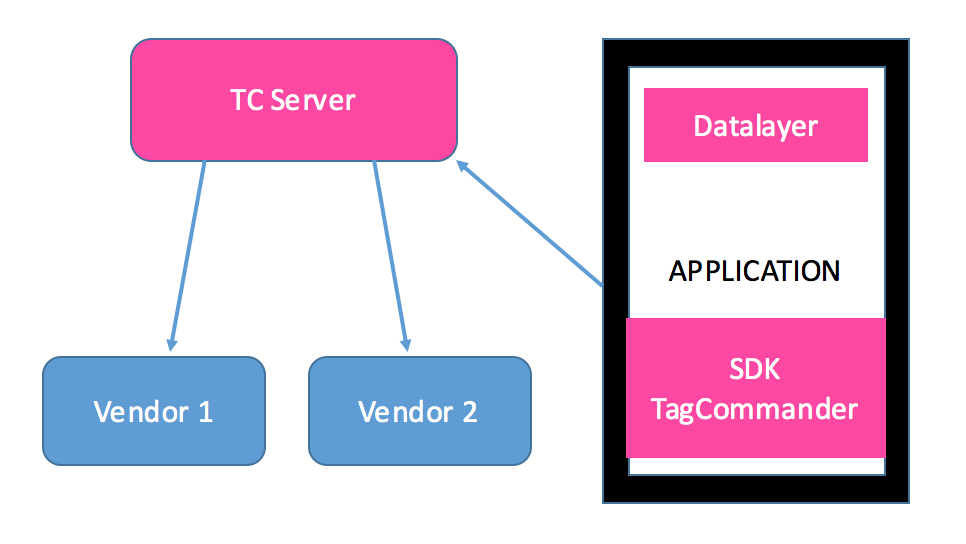

<html>
<body>

<h1 id="sdks-implementation-guide">SDK's Implementation Guide</h1>

<strong>iOS</strong>

Last update : <em>03/08/2020</em> 
Release version : <em>4.5.3</em>

<ul>
<li><a href="#sdks-implementation-guide">SDK's Implementation Guide</a></li>
<li><a href="#introduction">Introduction</a><ul>
<li><a href="#main-technical-specifications">Main Technical Specifications</a></li>
<li><a href="#dynamic-variables">Dynamic Variables</a></li>
<li><a href="#execution">Execution</a></li>
</ul>
</li>
<li><a href="#sdk-integration">SDK integration</a><ul>
<li><a href="#steps">Steps</a></li>
<li><a href="#integration-of-the-sdk-module">Integration of the SDK Module</a></li>
<li><a href="#dependencies">Dependencies</a></li>
<li><a href="#compiler-flags">Compiler Flags</a></li>
<li><a href="#compatibility">Compatibility</a></li>
</ul>
</li>
<li><a href="#using-the-sdk">Using the SDK</a><ul>
<li><a href="#initialisation">Initialisation</a></li>
<li><a href="#executing-tags">Executing tags</a></li>
<li><a href="#example">Example</a></li>
<li><a href="#product-tags">Product tags</a></li>
<li><a href="#background-mode">Background Mode</a></li>
<li><a href="#deactivating-the-sdk">Deactivating the SDK</a></li>
</ul>
</li>
<li><a href="#troubleshooting">Troubleshooting</a><ul>
<li><a href="#debugging">Debugging</a></li>
<li><a href="#testing">Testing</a></li>
<li><a href="#common-errors">Common errors</a></li>
<li><a href="#common-errors-with-the-tagging-plan">Common errors with the tagging plan</a></li>
</ul>
</li>
<li><a href="#helpers">Helpers</a><ul>
<li><a href="#persisting-variables">Persisting variables</a></li>
<li><a href="#tcpredefinedvariables">TCPredefinedVariables</a></li>
</ul>
</li>
<li><a href="#swift">Swift</a></li>
<li><a href="#example-tcdemo">Example: TCDemo</a></li>
<li><a href="#migration-from-v2-and-v3-to-v4">Migration from v2 and v3 to v4</a></li>
<li><a href="#support-and-contacts">Support and contacts</a></li>
</ul>

<h1 id="introduction">Introduction</h1>

Commanders Act enables marketers to easily add, edit, update, and deactivate tags on web pages, videos and mobile applications with little-to-no support from IT departments.

Instead of implementing several SDK's in the application, Commanders Act for mobile provides clients with a single SDK which sends data to our server which then create and send hits to your partners.

Owing to remote configuration tools, it is also possible to modify the configuration without having to resubmit your application.

The purpose of this document is to explain how to add the SDK module into your application.

<h2 id="main-technical-specifications">Main Technical Specifications</h2>
<ul>
<li>Weight from 110 ko to 120 ko in your application depending on the iPhone model.</li>
<li>Fully threaded and asynchronous.</li>
<li>Offline mode (the hits are stored in the phone to be replayed at the next launch.)</li>
<li>Very low CPU and memory usage.</li>
<li>Dynamic variable storage. If a value never changes, it's possible to set it only once.</li>
<li>The state of the phone is easily accessed through the module (network connection type, name of the phone, geographical location.)</li>
<li>Background mode, in the case you really need to send data while the application is in background.</li>
</ul>
<h2 id="dynamic-variables">Dynamic Variables</h2>

A dynamic variable is a combination of a name and a value. It is used to give the module data such as the name of the current screen or the product ID in a cart.

Dynamic Variables are implemented inside the application. They are replaced on the server at the time of the execution by the value transmitted.

A dynamic variable is formatted like this: <code>#SCREEN#</code>.

<blockquote>

The dynamic variables are case sensitive. They should always be in
upper case. The dynamic variable both begins and ends with a <code>#</code>. Don't
forget them when setting your dynamic variables.

</blockquote>

Dynamic Variables has two purposes:

<ol>
<li>Define information for analytics purposes. For instance, you would put <code>restaurants_list</code> in the <code>#SCREEN#</code> dynamic variable.</li>
<li>Test if conditions are met to fire a tag. For instance, if you set the <code>#EVENT#</code> to <code>click</code>, the tag with the condition <code>#EVENT# EQUAL 'click'</code> will be executed.</li>
</ol>
<h2 id="execution">Execution</h2>

When you call the sendData method, a hit will be packaged and sent to Commanders Act's server.

<h1 id="sdk-integration">SDK integration</h1>
<h2 id="steps">Steps</h2>

You can divide the integration of TagCommander's SDK into four steps:

<ol>
<li>Add the required frameworks</li>
<li>Add the TagCommander framework</li>
<li>Implement TagCommander in your application according to the tagging plan.</li>
<li>Verify that all tags are being sent</li>
</ol>
<h2 id="integration-of-the-sdk-module">Integration of the SDK Module</h2>

Please check the Developers Implementation Guide to chose the best way to implement this module in your project.

<h2 id="dependencies">Dependencies</h2>

TagCommander requires the following frameworks:

<ul>
<li>SystemConfiguration.framework</li>
<li>libz.dylib</li>
</ul>
<h2 id="compiler-flags">Compiler Flags</h2>

Please add the following option to your projects setting or xcconfig file

OTHER_LDFLAGS = $(inherited) -ObjC

<h2 id="compatibility">Compatibility</h2>
<ul>
<li>Architecture: armv7, arm64, i386 and x86_64, bitcode sections</li>
<li>iOS version: 7.0 minimum</li>
<li>Compiled with the ENABLE_BITCODE = YES option</li>
<li>Compiled with ARC enabled</li>
</ul>
<h1 id="using-the-sdk">Using the SDK</h1>
<h2 id="initialisation">Initialisation</h2>

It is recommended to initialise TagCommander in your <code>AppDelegate's applicationdidFinishLaunchingWithOptions</code>
 so it will be operational as soon as possible.

A single line of code is required to properly initialize an instance of TagCommander:

<pre><code>TagCommander *TagCommanderInstance = [[TagCommander alloc] initWithSiteID: siteID
                                                           andContainerID: containerID];
</code></pre>

<blockquote>

This class is not a Singleton. If you have the need for only one pair
of siteID's and containerID's, you might want to use it as a Singleton
anyway for reasons of simplification.

</blockquote>

<blockquote>

Since Apple now forces NSLocationAlwaysUsageDescription if they find any code related on location, we are removing TCLocation.
If you want to still use the same variables to match pre-existing tags, please use #TC_LONGITUDE# and #TC_LATITUDE#.

</blockquote>
<h2 id="executing-tags">Executing tags</h2>

For every element that needs tagging in your application, you need to call addData on your TagCommander instance and when you want to send all those information to the server, you will simply need to call sendData.

<pre><code>[TCInstance addData: @"#EVENT#" withValue: @"click"];
[TCInstance addData: @"#PAGE#" withValue: @"order"];
[TCInstance addData: @"#AMOUNT#" withValue: @"584.46"];

[TCInstance sendData];
</code></pre>

For compatibility reasons or for synchronisation reasons, you can still use TCAppVars to pass those information to TagCommander.

<pre><code>TCAppVars *appVar = [[TCAppVars alloc] init];
[appVar set: @"#EVENT#" withValue: @"click"];
[appVar set: @"#PAGE#" withValue: @"order"];
[appVar set: @"#AMOUNT#" withValue: @"584.46"];

[self.TCInstance execute: appVar];
</code></pre>

<blockquote>

Always handle values as NSStrings!

</blockquote>
<h2 id="example">Example</h2>

Let's say that the URL you are using in your server-side container uses the following url:

<pre><code>:::url
http://engage.commander1.com/dms?tc_s=3109&amp;tc_type=dms&amp;data_sysname=#TC_SYSNAME#
&amp;data_sysversion=#TC_SYSVERSION#&amp;page=#SCREEN_NAME#&amp;event=#EVENT#
</code></pre>

In order to be executed, the tag needs two values:

<ul>
<li><code>#EVENT#</code></li>
<li><code>#SCREEN_NAME#</code></li>
</ul>

With the code from the previous section, this tag could be fired from Commanders Act's server. The application sends two dynamic variables (<code>#EVENT#</code> and <code>#SCREEN_NAME#</code>) and the SDK adds all information available to it (like #TC_SYSVERSION# and #TC_SYSNAME# in this hit).

<h2 id="product-tags">Product tags</h2>

There are some tags that need to be passed a list of dictionaries, usually representing products. By passing complex information, we are able to create and send complex hits or many hits at the same time.

Tags that needs to be passed a list of dictionaries are easy to spot in the configuration. They have appended to the name of the dynamic variable the name of the key that is retrieved from the dictionary.

Most of the time the data are provided ready to use, but we provide a TCProduct class representing a product and its possible values.

<pre><code>[TCInstance addData: @"#EVENT#" withValue: @"viewCart"];
[TCInstance addData: @"#PARTNER_ID#" withValue: @"868"];
[TCInstance addData: @"#REGIONAL_CODE#" withValue: @"eu"];

TCProduct *product1 = [[TCProduct alloc] init];
product1.ID = @"22561563";
product1.priceATI = @"1.2";
product1.quantity = @"1";
[TCInstance addData: @"#ORDER_PRODUCTS#" withProduct: product1];

TCProduct *product2 = [[TCProduct alloc] init];
product2.ID = @"21669790";
product2.priceATI = @"3.4";
product2.quantity = @"2";
[TCInstance addData: @"#ORDER_PRODUCTS#" withProduct: product2];

TCProduct *product3 = [[TCProduct alloc] init];
product3.ID = @"3886822";
product3.priceATI = @"5.4";
product3.quantity = @"3";
[TCInstance addData: @"#ORDER_PRODUCTS#" withProduct: product3];
[TCInstance sendData];
</code></pre>

The following properties can be used with the TCProduct class:

<ul>
<li>ID</li>
<li>name</li>
<li>quantity</li>
<li>category</li>
<li>priceATI</li>
<li>discountATI</li>
<li>priceTF</li>
<li>discountTF</li>
<li>trademark</li>
<li>URLPage</li>
<li>URLPicture</li>
<li>rating</li>
<li>inStock</li>
</ul>

If you want to add more properties, please use the method on your TCProduct instance:

<pre><code>[product.customProperties setValue: @"12" forKey: @"Menu"];
[product.customProperties setValue: @"0" forKey: @"TakeOut"];
</code></pre>

<blockquote>

If you are updating from an old version of TagCommander you can still use old functions with TCAppVars and a list of products.

</blockquote>
<h2 id="background-mode">Background Mode</h2>

While the application is goind to background, the SDK sends all data that was already queued then stops. This is in order to preserve battery life and not use carrier data when not required.

But some applications need to be able to continue sending data because they have real background activities. For example listening to music.

For those cases, we added a way to bypass the way to SDK usually react to background. Please call:

<pre><code>[tc enableRunningInBackground];
</code></pre>

One drawback is that we're not able to ascertain when the application will really be killed. In normal mode, we're saving all hits not sent when going in the background, which is not possible here anymore. To be sure to not loose any hits in background mode, we will save much more often the offline hits. 

Please assure that your application has background modes enabled to use this feature.

<h2 id="deactivating-the-sdk">Deactivating the SDK</h2>

If you want to show a privacy message to your users allowing them to stop the tracking, you might want to use the following function to stop it if they refuse to be tracked.

<pre><code>[TCInstance deactivateSDK];
</code></pre>

What this function does is stopping all systems in the SDK that update automatically or listen to notifications like background or internet reachability. This will also ignore all calls to the SDK by your application so that nothing is treated anymore and you don't have to protect those calls manually.

<pre><code>[TCInstance activateSDK];
</code></pre>

In the case you need to re-enable it after disabling it the first time, you can use this function.

<h1 id="troubleshooting">Troubleshooting</h1>

The TagCommander SDK also offers methods to help you with the Quality Assessment of the SDK implementation.

<h2 id="debugging">Debugging</h2>

We recommend using TCLogLevel_Verbose while developing your application:

<pre><code>// Put it before the TagCommander initialization
#ifdef DEBUG
[TCDebug setDebugLevel: TCLogLevel_Verbose];
[TCDebug setNotificationLog: YES];
#end
</code></pre>
<ul>
<li>

The first line allows you to select the verbosity of TagCommander's logs.

<ul>
<li>Verbosity</li>
</ul>
<table>
<thead>
<tr>
<th>Constant Name</th>
<th>Verbosity</th>
</tr>
</thead>
<tbody>
<tr>
<td>TCLogLevel_Verbose</td>
<td>Print everything.</td>
</tr>
<tr>
<td>TCLogLevel_Debug</td>
<td>Most useful information for debugging.</td>
</tr>
<tr>
<td>TCLogLevel_Info</td>
<td>Basic information about TagCommander's state.</td>
</tr>
<tr>
<td>TCLogLevel_Warn</td>
<td>Warnings only.</td>
</tr>
<tr>
<td>TCLogLevel_Error</td>
<td>Errors only.</td>
</tr>
<tr>
<td>TCLogLevel_Assert</td>
<td>Asserts only.</td>
</tr>
<tr>
<td>TCLogLevel_None</td>
<td>No print at all.</td>
</tr>
</tbody>
</table>
</li>
<li>

The internal architecture is working with internal notifications. You can ask the Logger to display all the internal notifications with setNotificationLog: YES.

</li>
</ul>
<h2 id="testing">Testing</h2>

There are three ways to verify that the module executes the tags in your application:

<ul>
<li>By reading the debug messages in the console.</li>
<li>By going to your vendor's platform and check that the hits are displayed and that the data is correct. Please be aware that hits may not display immediately in the vendor account. This delay differs widely between vendors and may also vary for the type of hit under the same vendor.</li>
<li>You can also use a network monitor like Wireshark or Charles to check directly what is being sent on the wire to your vendors.</li>
</ul>
<h2 id="common-errors">Common errors</h2>

<blockquote>
<ul>
<li>Enable the debug logs if you have any doubt.</li>
<li>Check if TagCommander is called when you think it is. You should see it in the console logs.</li>
<li>Make sure you have the latest version.</li>
</ul>
</blockquote>
<h2 id="common-errors-with-the-tagging-plan">Common errors with the tagging plan</h2>

<blockquote>
<ul>
<li>Don't forget the # at the beginning and the end of each dynamic variable.</li>
<li>Always use the String type for the value of each dynamic variable.</li>
<li>Always use upper case dynamic variables.</li>
<li>The dynamic variables are case sensitive.</li>
<li>If you don't set the correct value for one dynamic variable, an empty string will replace it.</li>
</ul>
</blockquote>
<h1 id="helpers">Helpers</h1>
<h2 id="persisting-variables">Persisting variables</h2>

TagCommander permits storing of variables that remain the same in the whole application, such as vendors ID, in a TagCommander instance, instead of sending them each time you want to send data.

These variables will have a lower priority to the one given by the addData method but will persist for the whole run of the application.

<pre><code>:::objectivec
[self.TagCommanderInstance addPermanentData: @"#VENDOR_ID#" withValue: @"UE-556XXXXX-01"];
</code></pre>

They can also be removed if necessary.

<pre><code>:::objectivec
[self.TagCommanderInstance removePermanentData: @"#VENDOR_ID#"];
</code></pre>
<h2 id="tcpredefinedvariables">TCPredefinedVariables</h2>

TagCommander collects a great deal of information to function with accuracy.
You can ask for any variables computed by TagCommander through a simple getData on TCPredefinedVariables.

The two following line are doing exactly the same thing, one using the constants declared in the SDK, the second using the name of the variable as defined in PredefinedVariables.xlsx. You can use either one.

<pre><code>TCPredefinedVariables *predefVariables = [TCPredefinedVariables sharedInstance];
NSString *currentVisit = [predefVariables getData: kTCPredefinedVariable_CurrentVisitMs];
NSString *currentVisit = [predefVariables getData: @"#TC_CURRENT_VISIT_MS#"];
</code></pre>

You can find a full list of variables computed by the SDK, explanations and examples here: 

<a href="PredefinedVariables.md">TCPredefinedVariables</a>

<h1 id="swift">Swift</h1>

If you want to use Swift as your main language, please check the demo <a href="https://github.com/TagCommander/TagCommander-In-Swift">TagCommander-In-Swift</a>.

<h1 id="example-tcdemo">Example: TCDemo</h1>

To check an example of how to use this module, please check: 

<a href="https://github.com/TagCommander/Tag-Demo/tree/master/iOS">Tag Demo</a>

<h1 id="migration-from-v2-and-v3-to-v4">Migration from v2 and v3 to v4</h1>

The way we are doing thing in v4 is quite different as we can only send data in post and to TagCommander's servers. But the code didn't change much and we can still use the old basic integration for the v4.

Remove all function not existing anymore like forceReload and the rest should still work.
To use new methods you can check in this document how to.

<blockquote>

You don't have to update your tagging plan in the application ! You should be able to keep your previous execute as is.
What needs to be changed is the container in your TagCommander interface, please check with your consultant.

</blockquote>
<h1 id="support-and-contacts">Support and contacts</h1>

<strong>Support</strong>
<em>support@commandersact.com</em>

http://www.commandersact.com

Commanders Act | 3/5 rue Saint Georges - 75009 PARIS - France

This documentation was generated on 03/08/2020 16:01:11

</body>
</html>