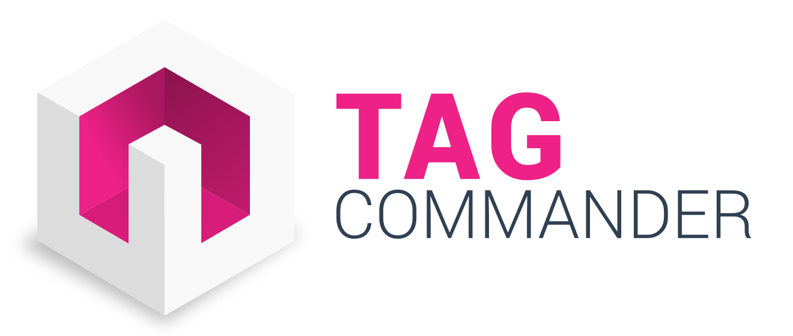

<html>
<body>

<h1 id="sdks-implementation-guide">SDK's Implementation Guide</h1>

<strong>${platform}</strong>

Last update : <em>02/09/2021</em> 
Release version : <em>4.6.4</em>

<ul>
<li><a href="#sdks-implementation-guide">SDK's Implementation Guide</a></li>
<li><a href="#introduction">Introduction</a><ul>
<li><a href="#main-technical-specifications">Main Technical Specifications</a></li>
<li><a href="#dynamic-variables">Dynamic Variables</a></li>
<li><a href="#execution">Execution</a></li>
<li><a href="#example">Example</a></li>
<li><a href="#privacy">Privacy</a></li>
</ul>
</li>
<li><a href="#troubleshooting">Troubleshooting</a><ul>
<li><a href="#testing">Testing</a></li>
<li><a href="#common-errors">Common errors</a></li>
<li><a href="#common-errors-with-the-tagging-plan">Common errors with the tagging plan</a></li>
</ul>
</li>
<li><a href="#support-and-contacts">Support and contacts</a></li>
</ul>

<h1 id="introduction">Introduction</h1>

Commanders Act enables marketers to easily add, edit, update, and deactivate tags on web pages, videos and mobile applications with little-to-no support from IT departments.

Instead of implementing several SDK's in the application, Commanders Act for mobile provides clients with a single SDK which sends data to our server which then create and send hits to your partners.

Owing to remote configuration tools, it is also possible to modify the configuration without having to resubmit your application.

The purpose of this document is to explain how to add the SDK module into your application.

<h2 id="main-technical-specifications">Main Technical Specifications</h2>
<ul>
<li>Fully threaded and asynchronous.</li>
<li>Offline mode (the hits are stored in the phone to be replayed at the next launch.)</li>
<li>Very low CPU and memory usage.</li>
<li>Dynamic variable storage. If a value never changes, it's possible to set it only once.</li>
<li>The state of the phone is easily accessed through the module (network connection type, name of the phone, geographical location.)</li>
<li>Background mode, in the case you really need to send data while the application is in background.</li>
</ul>
<h2 id="dynamic-variables">Dynamic Variables</h2>

A dynamic variable is a combination of a name and a value. It is used to give the module data such as the name of the current screen or the product ID in a cart.

Dynamic Variables are implemented inside the application. They are replaced on the server at the time of the execution by the value transmitted.

A dynamic variable is formatted like this: <code>#SCREEN#</code>.

<blockquote>

The dynamic variables are case sensitive. They should always be in
upper case. The dynamic variable both begins and ends with a <code>#</code>. Don't
forget them when setting your dynamic variables.

</blockquote>

Dynamic Variables has two purposes:

<ol>
<li>Define information for analytics purposes. For instance, you would put <code>restaurants_list</code> in the <code>#SCREEN#</code> dynamic variable.</li>
<li>Test if conditions are met to fire a tag. For instance, if you set the <code>#EVENT#</code> to <code>click</code>, the tag with the condition <code>#EVENT# EQUAL 'click'</code> will be executed.</li>
</ol>
<h2 id="execution">Execution</h2>

When you call the sendData method, a hit will be packaged and sent to Commanders Act's server.

<h2 id="example">Example</h2>

Let's say that the URL you are using in your server-side container uses the following url:

<pre><code>:::url
http://engage.commander1.com/dms?tc_s=3109&amp;tc_type=dms&amp;data_sysname=#TC_SYSNAME#
&amp;data_sysversion=#TC_SYSVERSION#&amp;page=#SCREEN_NAME#&amp;event=#EVENT#
</code></pre>

In order to be executed, the tag needs two values:

<ul>
<li><code>#EVENT#</code></li>
<li><code>#SCREEN_NAME#</code></li>
</ul>

With the code from the previous section, this tag could be fired from Commanders Act's server. The application sends two dynamic variables (<code>#EVENT#</code> and <code>#SCREEN_NAME#</code>) and the SDK adds all information available to it (like #TC_SYSVERSION# and #TC_SYSNAME# in this hit).

<h2 id="privacy">Privacy</h2>

To manage the privacy of the user's data you can use our Trust product, another product or nothing at all.

By default, the SDK will try to see if you have added our Privacy module. If so, it will put itself into a waiting for consent mode. In this mode, it will record all hits but wait to consent information to either send everything or delete all waiting hits.

If you don't use our Privacy module, the SDK will be enabled by default.

If you want to change those dehaviours, we added a way to initialise the TagCommander module with an additional information about the behaviour.
For now we have 3 behaviours:

<pre><code>- PB_DEFAULT_BEHAVIOUR which is the one described just before
- PB_ALWAYS_ENABLED which forces the SDK to always send information. This is used when you have tags that don't require consent.
- PB_DISABLED_BY_DEFAULT which forces the SDK to disabled. It won't record hits before consent is given and you won't have any up by default time when using tagging the app loading screens. (This might only happen when you're not using our Privacy module)
</code></pre>
<h1 id="troubleshooting">Troubleshooting</h1>

The TagCommander SDK also offers methods to help you with the Quality Assessment of the SDK implementation.

<h2 id="testing">Testing</h2>

There are three ways to verify that the module executes the tags in your application:

<ul>
<li>By reading the debug messages in the console.</li>
<li>By going to your vendor's platform and check that the hits are displayed and that the data is correct. Please be aware that hits may not display immediately in the vendor account. This delay differs widely between vendors and may also vary for the type of hit under the same vendor.</li>
<li>You can also use a network monitor like Wireshark or Charles to check directly what is being sent on the wire to your vendors.</li>
</ul>
<h2 id="common-errors">Common errors</h2>

<blockquote>
<ul>
<li>Enable the debug logs if you have any doubt.</li>
<li>Check if TagCommander is called when you think it is. You should see it in the console logs.</li>
<li>Make sure you have the latest version.</li>
</ul>
</blockquote>
<h2 id="common-errors-with-the-tagging-plan">Common errors with the tagging plan</h2>

<blockquote>
<ul>
<li>Don't forget the # at the beginning and the end of each dynamic variable.</li>
<li>Always use the String type for the value of each dynamic variable.</li>
<li>Always use upper case dynamic variables.</li>
<li>The dynamic variables are case sensitive.</li>
<li>If you don't set the correct value for one dynamic variable, an empty string will replace it.</li>
</ul>
</blockquote>
<h1 id="support-and-contacts">Support and contacts</h1>

<strong>Support</strong>
<em>support@commandersact.com</em>

http://www.commandersact.com

Commanders Act | 3/5 rue Saint Georges - 75009 PARIS - France

This documentation was generated on 02/09/2021 14:12:09

</body>
</html>